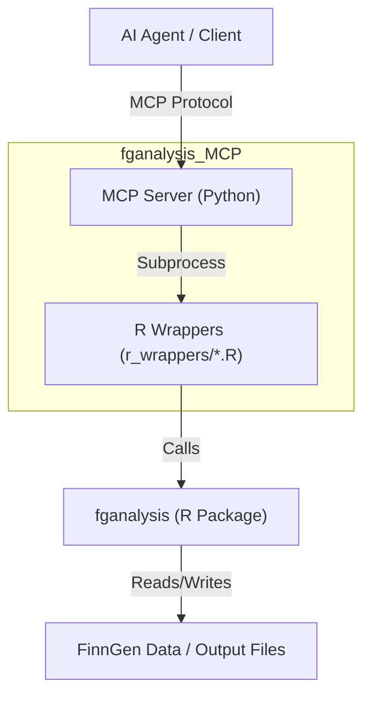
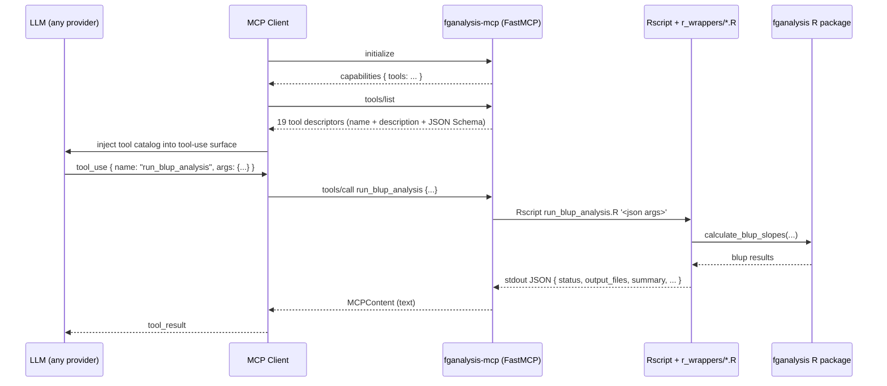

# fganalysis MCP Server

An MCP server that exposes the `fganalysis` R package to agentic workflows. The server is designed for tools such as ClawBio that need structured access to FinnGen lab, drug-purchase, drug-response, BLUP-slope, median pre-drug phenotype, and ATC-code-mapping workflows.

This server is the executable backbone behind [`agentic_FinnGen`](https://github.com/RezaJF/agentic_FinnGen) (Mithril) — *"an advanced multi-agent system designed to accelerate biomedical research using FinnGen data"* — which uses Google ADK and Gemini 1.5 Pro to plan, research, analyse, code, and review FinnGen analyses, and reaches the underlying R bioinformatics environment **only through this server's MCP surface**.

## Demo

<p align="center">
  <a href="https://youtu.be/x86xGqBB3hg" title="Mithril × fganalysis-mcp — agentic FinnGen analysis demo">
    
  </a>
  <br>
  <em>▶ Watch the Mithril × fganalysis-mcp walk-through on YouTube</em>
</p>

End-to-end demonstration of the Mithril multi-agent system answering real clinical-research questions over FinnGen data through this server's MCP tools.

> **Note on inline playback:** GitHub's markdown sanitiser strips `<iframe>` tags, so true inline YouTube embedding is not possible in a README. The thumbnail above is the standard GitHub-friendly pattern — click it to play on YouTube.

## Prerequisites

- Python 3.10+
- R 4.3+ with the `fganalysis` package installed
- `jsonlite`, `dplyr`, `ggplot2`, and the R dependencies required by `fganalysis`
- Optional: `google-generativeai` for notebook generation

## Installation

1.  Clone this repository (as a sibling to `fganalysis-r`):
    ```bash
    git clone <repo_url> fganalysis_MCP
    ```

2.  Install Python dependencies:
    ```bash
    pip install -e .
    ```

3.  Configure the default data connection:
    ```bash
    export FGANALYSIS_CONFIG_PATH=/path/to/fganalysis-r/config/db_config.json
    ```

    Each tool also accepts an explicit `config_path`, which is preferred for reproducible agent workflows.

## Architecture



## Usage

### Running the Server

You can run the server using the installed console script or directly via Python.

```bash
fganalysis-mcp
```

```bash
python -m fganalysis_mcp.server
```

### Available Tools

- `inspect_fganalysis_environment`: Reports R, `fganalysis`, exported-function, wrapper, and optional config status.
- `validate_fganalysis_config`: Validates the JSON connection config required by `connect_fgdata()`.
- `get_lab_data_summary`: Counts and previews selected OMOP lab concept IDs.
- `get_drug_purchases`: Counts and previews purchases for ATC code prefixes, with optional ATC mapping.
- `get_first_drug_purchase`: Returns the first qualifying drug purchase per FINNGENID.
- `get_measurements_before_drug`: Extracts pre-drug lab measurements (with exposed/unexposed indicators).
- `run_drug_response_analysis`: Builds drug-response data and writes summary plots/tables.
- `run_blup_analysis`: Calculates BLUP slopes from pre-drug longitudinal lab measurements.
- `calculate_fixed_slopes`: OLS per-individual slopes (BLUP-comparable baseline).
- `get_median_pre_drug_values`: Creates GWAS-ready median pre-drug phenotype files.
- `plot_lab_distribution`: Writes before/after lab-value distribution plots.
- `plot_median_pre_drug_diagnostics`: Diagnostic before/after MAD outlier removal plots.
- `compute_drug_purchase_cadence`: Per-VNR purchase-interval (cadence) statistics.
- `process_variance_files`: Inverse-rank-normalises BLUP variance files and summarises results.
- `get_atc_code_relationships`: Expands ATC codes and returns historical/current relationships.
- `load_atc_mappings_info`: Reports the active ATC mapping file metadata and preview.
- `clear_atc_mappings_cache`: Clears the in-memory ATC mapping cache.
- `execute_r_code`: Executes focused R snippets with `conn` and exported `fganalysis` functions in scope.
- `generate_analysis_notebook`: Optional notebook generation, requiring `google-generativeai`.

## Architecture

The server is written in Python and uses `subprocess` to call standalone R scripts located in `r_wrappers/`. Wrapper scripts use `r_wrappers/common.R` so progress output from R is captured and the MCP client receives one structured JSON object.

## MCP Protocol Surface — How LLMs Discover and Use These Tools

This section describes how the server exposes its 19 tools to any MCP-aware LLM client, contrasts that surface with markdown-style "skills" or rules, and shows how it fits into the [`agentic_FinnGen`](https://github.com/RezaJF/agentic_FinnGen) (Mithril) multi-agent workflow.

### Protocol mechanics

When a client launches `fganalysis-mcp`, the conversation runs over a stdio JSON-RPC stream in three phases:

**1. Initialization handshake.** The client sends an `initialize` request with its protocol version and capabilities. The FastMCP server replies with its name (`"fganalysis-mcp"`), version, and the capabilities it supports — most importantly `tools`.

**2. Tool discovery.** The client sends `tools/list`. The server walks every Python function decorated with `@mcp.tool()` and returns a structured catalog. Each entry includes the tool name, the docstring as a human-readable description, and a JSON Schema generated from the function signature's type hints. For example, `get_lab_data_summary` becomes:

```json
{
  "name": "get_lab_data_summary",
  "description": "Return count and preview rows for selected OMOP lab concept IDs.",
  "inputSchema": {
    "type": "object",
    "properties": {
      "lab_id":              {"type": "array", "items": {"type": "string"}},
      "require_values":      {"type": "boolean", "default": true},
      "use_freetext_values": {"type": "boolean", "default": true},
      "limit":               {"type": "integer", "default": 10},
      "config_path":         {"type": ["string", "null"]}
    },
    "required": ["lab_id"]
  }
}
```

The client injects this catalog into the model's native tool-use channel — the same channel any model uses for function calling. The model never reads R code; it reads a typed contract.

**3. Tool invocation.** When the model picks a tool, the client packages arguments into a `tools/call` request matching the schema. The server validates them, runs the handler (spawn `Rscript`, marshal a JSON parameter blob to the wrapper, parse one structured JSON object back from stdout), and returns the result as `MCPContent`. The client surfaces that result to the model as the tool result.

From the model's perspective R is invisible: it sees 19 well-typed tools with descriptive names, picks one, fills in JSON, reads a structured response. The same server is callable identically from Claude (any tier), Gemini wrapped in an MCP-aware client, GPT-class models with MCP support, and local models exposed through an MCP-aware orchestration framework. **Nineteen tools, one schema, every model.**



### MCP vs markdown / agent skills

Markdown "skills" — Cursor `.cursor/rules/*.mdc`, Claude Code skills, Goose recipes, generic system-prompt instructions — and MCP solve adjacent but distinct problems:

| Dimension | Markdown skills | MCP |
|---|---|---|
| **What it carries** | Natural-language instructions, conventions, recipes | Executable capabilities (functions, data, prompt templates) |
| **Validation** | None — the model interprets prose | JSON Schema enforcement at call time |
| **Discovery** | Model must read the file (or it's auto-injected as system prompt) | Programmatic `tools/list` over JSON-RPC |
| **Execution** | Model writes the code itself | Server runs the code; model only fills arguments |
| **Reusability across clients** | Each client re-implements its own loader | Any MCP-aware client picks it up unchanged |
| **State / connections** | Reset every prompt | Long-lived (a DB connection, an R session, an ATC cache) persists for the server's lifetime |
| **Failure mode** | Hallucinated function names, wrong R syntax | Schema-rejected arguments before any code runs |

**Skills tell the model *what to do*. MCP gives the model *how to do it.*** The two compose: a skill might say *"For FinnGen drug-response queries with cohorts > 5 000 individuals, prefer BLUP slopes over fixed slopes"* — that is policy. This server's `run_blup_analysis` and `calculate_fixed_slopes` are the mechanism that policy points at.

A pure-skills approach (the model writes R itself and executes it via a generic shell tool) loses three things this MCP server provides:

1. **Pre-flight validation.** Typed arguments rule out malformed calls before R starts.
2. **Stable, named pipelines.** `run_drug_response_analysis` is a contract, not a moving prompt-engineering target.
3. **Auditable side effects.** Every tool returns a JSON manifest of files written, row counts, warnings, and errors — suitable for log review and reproducibility.

### Fit with `agentic_FinnGen` (Mithril)

[`agentic_FinnGen`](https://github.com/RezaJF/agentic_FinnGen) — internal name **Mithril** — describes itself as *"an advanced multi-agent system designed to accelerate biomedical research using FinnGen data"*, built on Google's Agent Development Kit (ADK) with Gemini 1.5 Pro powering every agent. The capstone writeup ([Kaggle "Agents Intensive — Capstone Project", track *Agents for Good*](https://www.kaggle.com/competitions/agents-intensive-capstone-project/writeups/mithril-the-agentic-finngen-analysis-system)) frames the motivation directly: *"Mithril acts as a virtual research assistant that bridges the gap between medical expertise and bioinformatics. By automating the translation of clinical questions into rigorous statistical analyses, it democratizes access to the data and accelerates the pace of discovery."*

The system runs five specialised agents that collaborate through a hierarchical planner loop:

| Agent | Role | Responsibility |
|---|---|---|
| **Planner** | orchestrator / "central brain" | Decomposes the user query, manages session memory via `FileBasedMemory`, routes between standard pipelines and ad-hoc code generation. |
| **Researcher** | domain expert | Scrapes phenotype and ontology context from `risteys.finngen.fi`. |
| **Analyst** | statistician | Runs pre-defined pipelines (drug-response, BLUP) by calling MCP tools on this server. |
| **Coder** | programmer | Writes ad-hoc R against `fganalysis` for queries outside the pre-defined pipelines, executed through the sandboxed `execute_r_code` MCP tool. |
| **Reviewer** | auditor | Validates Coder output, checks "for logical errors or empty results", and triggers a retry loop (up to three attempts) before returning control to the Planner. |

The capstone writeup names the MCP boundary as a deliberate design pillar: *"A custom MCP server was built to bridge the Python-based agents with the R-based bioinformatics environment."* In Mithril's architecture diagram, both the Analyst and the Coder connect to `fganalysis MCP Server` over the **MCP Protocol** — i.e. *this* server. The "Why agents?" section adds a third pillar specific to the capability surface: *"Real-world code often fails. Agents can read error messages, debug their own code, and retry — something a standard script or LLM cannot do."* This MCP server is what makes that retry loop concrete: every tool returns a structured JSON envelope (`status`, `error_type`, `message`, `stderr`) instead of an unstructured shell error, so the Reviewer can reason over the failure programmatically.

Mithril's four headline use cases all flow through this boundary:

1. **GLP-1 agonist weight-loss analysis** — drug-response pipelines on cohorts exposed to GLP-1 agonists, via `run_drug_response_analysis` and `get_measurements_before_drug`.
2. **CKD trajectory modelling** — longitudinal eGFR slopes for chronic-kidney-disease progression, via `run_blup_analysis` and `calculate_fixed_slopes`.
3. **Comorbidity & polypharmacy overlap** — cohort intersection across hypertension / statin / GLP-1 exposures, via `get_drug_purchases` and `get_first_drug_purchase` with ATC-mapping enabled.
4. **Pharmacome-Wide Association Study (PheWAS)** — broad ATC-coded drug-purchase associations, via `get_atc_code_relationships` plus the median-pre-drug phenotype generators.

Today, Mithril's `src/tools/mcp_bridge.py` integrates with this server by manipulating `sys.path` and importing the Python module directly:

```python
# Current pattern in agentic_FinnGen — same process, no actual protocol
sys.path.insert(0, "../../../fganalysis_MCP")
from fganalysis_mcp.server import (
    run_drug_response_analysis, run_blup_analysis, get_lab_data_summary,
    get_drug_purchases, plot_lab_distribution, execute_r_code,
)
tools = [run_drug_response_analysis, ...]  # passed to Gemini function-calling
```

This works for a co-located prototype but couples Mithril to a specific filesystem layout (sibling directories), a single Python interpreter and process, and a single provider (Gemini's `google-generativeai` automatic function calling). It also exposes only the six tools the bridge happens to enumerate, leaving the other 13 tools in this server invisible to the agents.

Consuming this server as a real MCP client replaces the import shim with the standard pattern:

```python
# Future pattern — protocol-based, transport-decoupled, provider-agnostic
from mcp import ClientSession, StdioServerParameters
from mcp.client.stdio import stdio_client

async with stdio_client(StdioServerParameters(command="fganalysis-mcp")) as (read, write):
    async with ClientSession(read, write) as session:
        await session.initialize()
        tools = (await session.list_tools()).tools  # all 19 tools, schemas attached
        # hand `tools` to whichever provider Mithril is using this run
```

Concrete wins for Mithril:

- **Provider-portable.** Swap Gemini for Claude, GPT-class, or a local model without touching the bridge — Anthropic's SDK, OpenAI's MCP-aware clients, and the Claude Agent SDK all consume the same `tools/list` output.
- **Process-isolated.** R failures (segfault, OOM, runaway custom query from `execute_r_code`) bring down the wrapper subprocess only, not the Mithril Python process holding agent state and session memory.
- **Remote-deployable.** The same server runs on the FinnGen Sandbox, on a research VM, or behind an HTTP/SSE transport with no changes in `agentic_FinnGen` — only a different `StdioServerParameters` / transport URL.
- **Drift-resistant prompts.** Mithril's Coder currently prompts Gemini that "`conn` is already available" and "`fganalysis` and `dplyr` are loaded" — guidance that decays as the wrapper layer evolves. With MCP those invariants live in the tool descriptions returned by `tools/list`, where they stay synchronised with the actual server behaviour.
- **Full tool coverage.** All 19 tools become available to every Mithril agent automatically — no need to extend `get_fganalysis_tools()` each time a new wrapper is added here.

A pragmatic migration: keep `mcp_bridge.py` as a single bridge function that spawns `fganalysis-mcp`, calls `tools/list`, and adapts each MCP tool descriptor into a Gemini function-call descriptor. Once Mithril supports more than one provider, drop the adapter and let each provider's native MCP client consume the server unchanged.

### Roadmap as Mithril grows

The capstone *"If I had more time"* section names three forward-looking directions: (1) integrated GWAS and burden-testing pipelines, (2) [TxGemma](https://research.google/blog/introducing-txgemma-open-models-for-therapeutics/) integration for therapeutic-target reasoning, and (3) a unified end-to-end drug-discovery agent that composes Mithril + GWAS + TxGemma. Each of those builds *on top of* this server's existing 19 tools — adding new wrappers, not reshaping the protocol surface. The MCP contract holds: a richer `tools/list` response is the only thing Mithril (or any other client) needs to absorb. Concretely, GWAS integration adds a small number of new wrappers around association-test runners; TxGemma integration is a separate MCP server consumed in parallel; the drug-discovery composition is an agent-level orchestration concern, not a transport-level one.

## Development

To add a new tool:
1.  Create a new R script in `r_wrappers/` that accepts JSON arguments and prints JSON output.
2.  Add a new tool function in `fganalysis_mcp/server.py` that calls this script using `run_r_wrapper`.

## Example Usage

### Python Client Example

```python
from mcp import Client, StdioServerParameters

# Connect to the server
client = Client(StdioServerParameters(command="fganalysis-mcp"))

# List available tools
tools = await client.list_tools()
print(tools)

# Call a tool
result = await client.call_tool(
    "get_lab_data_summary",
    {"lab_id": ["3001308"], "config_path": "/path/to/db_config.json"},
)
print(result)
```

## Author

**Reza Jabal, PhD**
rjabal@broadinstitute.org

## License

This project is licensed under the MIT License.


