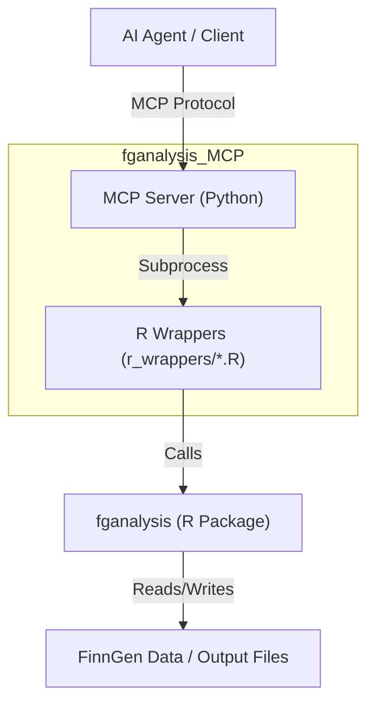

# fganalysis MCP Server

An MCP server that exposes the capabilities of the `fganalysis` R package to AI agents. It also includes a tool to generate Jupyter notebooks using Google Vertex AI.

## Prerequisites

- Python 3.10+
- R (with `fganalysis` package installed)
- Google Cloud Vertex AI API Key (for notebook generation)

## Installation

1.  Clone this repository (as a sibling to `fganalysis-r`):
    ```bash
    git clone <repo_url> fganalysis_MCP
    ```

2.  Install Python dependencies:
    ```bash
    pip install -e .
    ```

3.  Configure Environment:
    Create a `.env` file in the root directory (already created if you followed the setup):
    ```env
    VERTEX_API_KEY=your_api_key_here
    VERTEX_PROJECT_ID=your_project_id
    VERTEX_LOCATION=us-central1
    ```

## Architecture



## Usage

### Running the Server

You can run the server using the `mcp` CLI or directly via Python.

```bash
mcp run fganalysis_mcp/server.py
```

### Available Tools

-   `run_drug_response_analysis`: Performs drug response analysis.
-   `run_blup_analysis`: Calculates BLUP slopes.
-   `get_lab_data_summary`: Gets a summary of lab measurements.
-   `get_drug_purchases`: Gets a summary of drug purchases.
-   `plot_lab_distribution`: Generates a violin plot of lab values.
-   `generate_analysis_notebook`: Generates a Jupyter notebook for a specific analysis goal.

## Architecture

The server is written in Python and uses `subprocess` to call standalone R scripts located in `r_wrappers/`. These scripts interact with the `fganalysis` package and return JSON output.

## Development

To add a new tool:
1.  Create a new R script in `r_wrappers/` that accepts JSON arguments and prints JSON output.
2.  Add a new tool function in `fganalysis_mcp/server.py` that calls this script using `run_r_wrapper`.

## Example Usage

### Python Client Example

```python
from mcp import Client, StdioServerParameters

# Connect to the server
client = Client(StdioServerParameters(command="mcp", args=["run", "fganalysis_mcp/server.py"]))

# List available tools
tools = await client.list_tools()
print(tools)

# Call a tool
result = await client.call_tool("get_lab_data_summary", {"lab_id": "3001308"})
print(result)
```

## Author

**Reza Jabal, PhD**
rjabal@broadinstitute.org

## License

This project is licensed under the MIT License.


