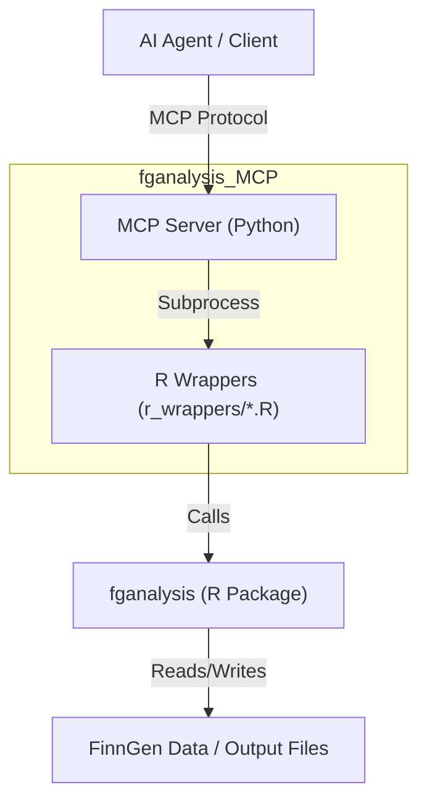

# fganalysis MCP Server

An MCP server that exposes the `fganalysis` R package to agentic workflows. The server is designed for tools such as ClawBio that need structured access to FinnGen lab, drug-purchase, drug-response, BLUP-slope, median pre-drug phenotype, and ATC-code-mapping workflows.

## Prerequisites

- Python 3.10+
- R 4.3+ with the `fganalysis` package installed
- `jsonlite`, `dplyr`, `ggplot2`, and the R dependencies required by `fganalysis`
- Optional: `google-generativeai` for notebook generation

## Installation

1.  Clone this repository (as a sibling to `fganalysis-r`):
    ```bash
    git clone <repo_url> fganalysis_MCP
    ```

2.  Install Python dependencies:
    ```bash
    pip install -e .
    ```

3.  Configure the default data connection:
    ```bash
    export FGANALYSIS_CONFIG_PATH=/path/to/fganalysis-r/config/db_config.json
    ```

    Each tool also accepts an explicit `config_path`, which is preferred for reproducible agent workflows.

## Architecture



## Usage

### Running the Server

You can run the server using the installed console script or directly via Python.

```bash
fganalysis-mcp
```

```bash
python -m fganalysis_mcp.server
```

### Available Tools

- `inspect_fganalysis_environment`: Reports R, `fganalysis`, exported-function, wrapper, and optional config status.
- `validate_fganalysis_config`: Validates the JSON connection config required by `connect_fgdata()`.
- `get_lab_data_summary`: Counts and previews selected OMOP lab concept IDs.
- `get_drug_purchases`: Counts and previews purchases for ATC code prefixes, with optional ATC mapping.
- `get_first_drug_purchase`: Returns the first qualifying drug purchase per FINNGENID.
- `get_measurements_before_drug`: Extracts pre-drug lab measurements (with exposed/unexposed indicators).
- `run_drug_response_analysis`: Builds drug-response data and writes summary plots/tables.
- `run_blup_analysis`: Calculates BLUP slopes from pre-drug longitudinal lab measurements.
- `calculate_fixed_slopes`: OLS per-individual slopes (BLUP-comparable baseline).
- `get_median_pre_drug_values`: Creates GWAS-ready median pre-drug phenotype files.
- `plot_lab_distribution`: Writes before/after lab-value distribution plots.
- `plot_median_pre_drug_diagnostics`: Diagnostic before/after MAD outlier removal plots.
- `compute_drug_purchase_cadence`: Per-VNR purchase-interval (cadence) statistics.
- `process_variance_files`: Inverse-rank-normalises BLUP variance files and summarises results.
- `get_atc_code_relationships`: Expands ATC codes and returns historical/current relationships.
- `load_atc_mappings_info`: Reports the active ATC mapping file metadata and preview.
- `clear_atc_mappings_cache`: Clears the in-memory ATC mapping cache.
- `execute_r_code`: Executes focused R snippets with `conn` and exported `fganalysis` functions in scope.
- `generate_analysis_notebook`: Optional notebook generation, requiring `google-generativeai`.

## Architecture

The server is written in Python and uses `subprocess` to call standalone R scripts located in `r_wrappers/`. Wrapper scripts use `r_wrappers/common.R` so progress output from R is captured and the MCP client receives one structured JSON object.

## Development

To add a new tool:
1.  Create a new R script in `r_wrappers/` that accepts JSON arguments and prints JSON output.
2.  Add a new tool function in `fganalysis_mcp/server.py` that calls this script using `run_r_wrapper`.

## Example Usage

### Python Client Example

```python
from mcp import Client, StdioServerParameters

# Connect to the server
client = Client(StdioServerParameters(command="fganalysis-mcp"))

# List available tools
tools = await client.list_tools()
print(tools)

# Call a tool
result = await client.call_tool(
    "get_lab_data_summary",
    {"lab_id": ["3001308"], "config_path": "/path/to/db_config.json"},
)
print(result)
```

## Author

**Reza Jabal, PhD**
rjabal@broadinstitute.org

## License

This project is licensed under the MIT License.


